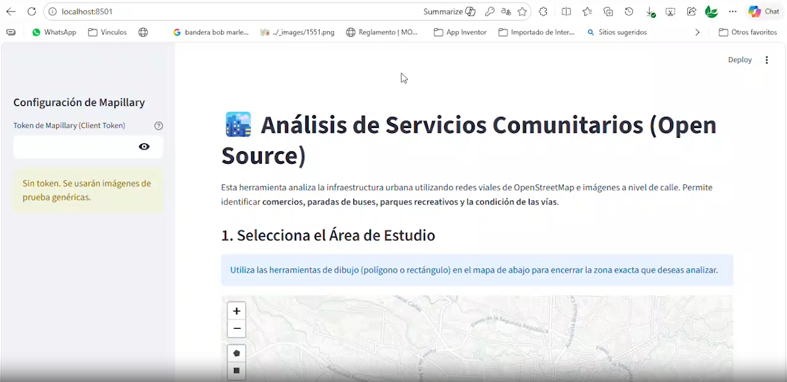

# 🏙️ Software de Análisis de Infraestructura en Comunidades (Open Source) Python

<h2>🎥 Video Demo</h2>

Haz clic en la imagen para ver el video en pantalla completa:

## Aplicación en la web en siguiente link:  https://hgw8axhgdu7zbvd2yxcyt7.streamlit.app/

Esta herramienta avanzada permite a comunidades y gobiernos locales realizar un inventario automatizado de infraestructura urbana utilizando Inteligencia Artificial, Visión por Computadora y Datos Geoespaciales. Al ejecutar el sofware, mantener calma y paciencia los procesos de análisis son complejos (iniciar pruebas con 4 cuadras).

## 🚀 Funcionalidades de Ingeniería Urbana

*   **🗺️ Selección de Área de Alta Precisión:** Dibuja polígonos irregulares para un análisis espacial delimitado.
*   **🤖 Arquitectura Dual-YOLO:**
    *   **Inferencia General (YOLO11x):** Detección de paradas de bus, mobiliario urbano y señalización.
    *   **Inferencia Especializada:** Soporte para modelos `custom` de detección de huecos en vias (baches) (`pothole_model.pt`).
*   **🛣️ Análisis Multimodal de Vías:** 
    *   **Visión OpenCV:** Análisis de textura por bordes (Canny) para medir la rugosidad del asfalto en tiempo real.
    *   **Fusión de Datos OSM:** Integración de tags oficiales de superficie y suavidad.
*   **🏢 Catastro Automático de Servicios (POI):** Mapeo con iconos temáticos de:
    *   🎓 Instituciones Educativas (Escuelas, Universidades)
    *   🏥 Salud (Clínicas, Hospitales, Farmacias)
    *   🚒 Seguridad (Estaciones de Bomberos)
    *   🏦 Sector Financiero (Bancos, Cajeros)
    *   🛒 Sector Comercial (Tiendas, Restaurantes)
*   **📐 Muestreo de Alta Densidad:** Interpolación automática de puntos de análisis cada **50 metros** a lo largo de toda la red vial.
*   **📊 Agregación Espacial de Resultados:** Resumen inteligente de datos por tramos de 50m para una visualización ejecutiva y clara.
*   **📥 Exportación Profesional:** Generación de archivos **GeoJSON** listos para QGIS, ArcGIS y Google My Maps.

## 🔑 Configuración de Mapillary (Imágenes Reales)

Para analizar fotografías reales, usar Client Token que viene por defecto ó ingresa tu Client Token en la barra lateral:
1. Regístrate en [mapillary.com/dashboard/developers](https://www.mapillary.com/dashboard/developers).
2. Crea una aplicación y obtén tu **Client Token**. 

## 🛠️ Instalación

1. Descarga el código y abre una terminal.
2. Instala dependencias: `py -m pip install -r requirements.txt`
3. Ejecuta: `py -m streamlit run app.py`

## ☁️ Despliegue en la Web (Streamlit Cloud)

Para que cualquier persona pueda acceder a tu herramienta a través de internet:
1.  **Sube el código a GitHub:** Crea un repositorio y sube todos los archivos de esta carpeta.
2.  **Conecta con Streamlit:** Entra en [share.streamlit.io](https://share.streamlit.io/) e inicia sesión con tu cuenta de GitHub.
3.  **Nueva Aplicación:** Haz clic en "New app", selecciona tu repositorio y el archivo principal `app.py`.
4.  **Despliegue:** Haz clic en "Deploy". Streamlit instalará automáticamente las dependencias y te dará una URL pública para tu herramienta.

---
## 💰 Opción Premium: Integración con Google Street View

Si el municipio cuenta con recursos económicos, se recomienda considerar la integración con la **API de Google Street View**:
*   **Ventaja:** Mayor cobertura fotográfica y actualización constante por parte de Google.
*   **Implementación:** Requiere una `API Key` de Google Cloud con facturación activa. 
*   **Beneficio:** Permite realizar análisis de infraestructura incluso en zonas donde la cobertura de Mapillary sea limitada o inexistente.

---
## ⚠️ Limitaciones Técnicas y Recomendaciones de Uso

*   **Límite de Imágenes:** Para garantizar la estabilidad de la API de Mapillary, la aplicación procesa un máximo de **500 fotografías** por polígono.
*   **Tamaño del Área:** En zonas urbanas densas, se recomienda analizar áreas no mayores a **1 km²** por ejecución para evitar errores de saturación de datos y optimizar los tiempos de inferencia de la IA.
*   **Calidad de Detección:** La precisión del estado de las vías depende de la calidad y el ángulo de la fotografía. Las fotos frontales o con pavimento húmedo pueden dar resultados variables.

## 🚛 Recomendación de Recolección (Mapeo Municipal)
Se recomienda a los municipios instalar cámaras 360 en vehículos de servicio (recolección de basura o patrullas) para actualizar sistemáticamente las imágenes de Mapillary de forma gratuita y colaborativa.

---
---
## 🎓 Entrenamiento de Modelos Personalizados

Para mejorar la precisión en la detección de baches o activos locales, se recomienda:
*   **Uso de Jupyter Notebooks / Google Colab:** Utilizar cuadernos de Jupyter para el entrenamiento de modelos YOLO. Google Colab es altamente recomendado por ofrecer **GPUs gratuitas**, lo que reduce el tiempo de entrenamiento de horas a minutos.
*   **Ultralytics YOLO:** Seguir los tutoriales de Ultralytics para realizar *Fine-Tuning* sobre el modelo base con imágenes propias de la comunidad capturadas con cámaras 360.
*   **Dataset Local:** Entrenar el modelo con el "paisaje visual" específico del municipio mejora drásticamente los resultados en comparación con modelos genéricos.

## ⚖️ Licencia
Este proyecto está bajo la **Licencia MIT**. Esto significa que es software libre y puede ser utilizado, modificado y distribuido tanto para fines comunitarios como comerciales. Ver el archivo [LICENSE](LICENSE) para más detalles.

---
**Herramienta diseñada para la modernización de la gestión pública local.**
